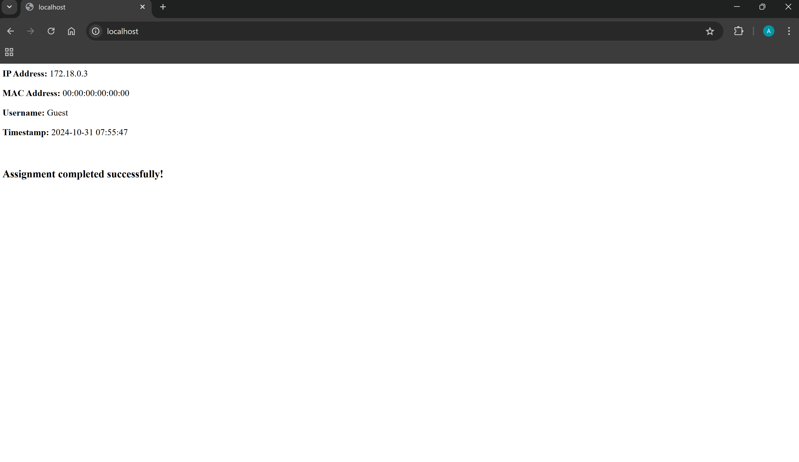
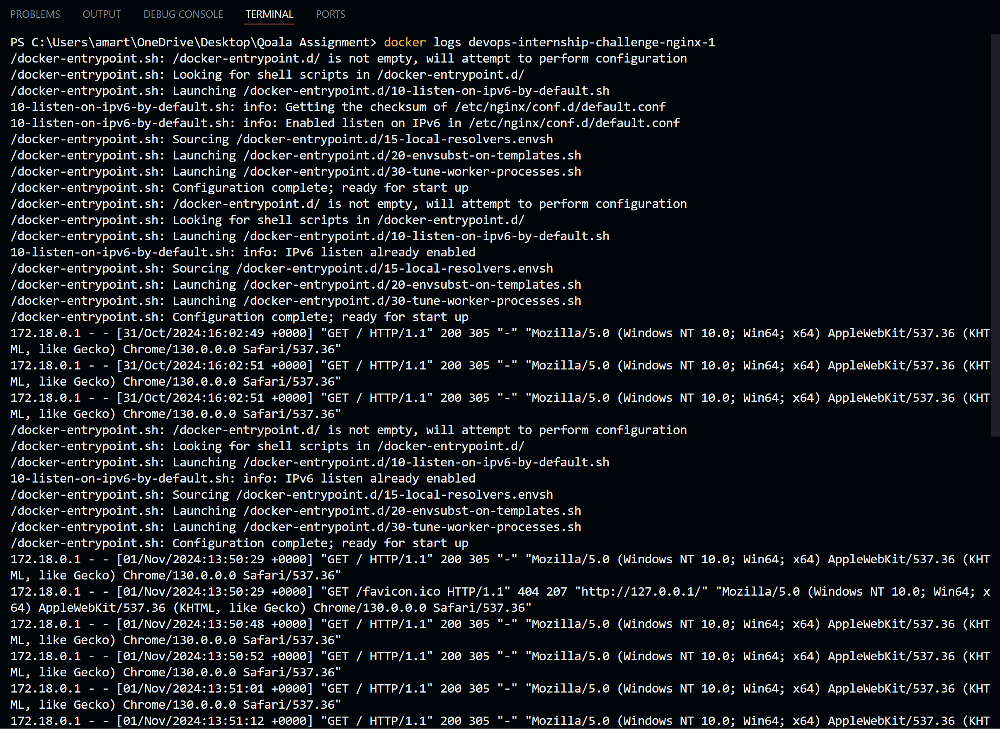
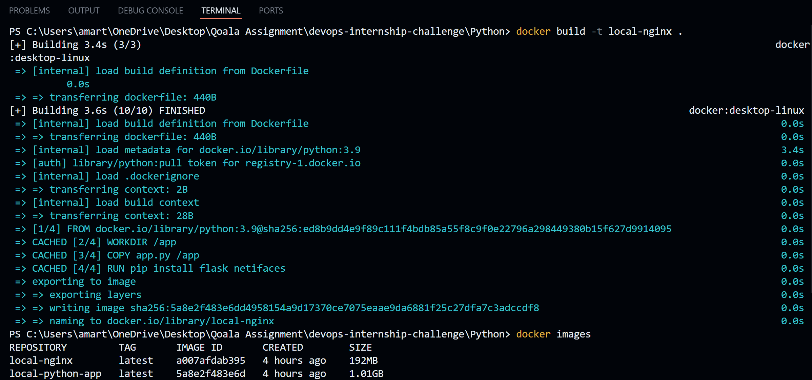
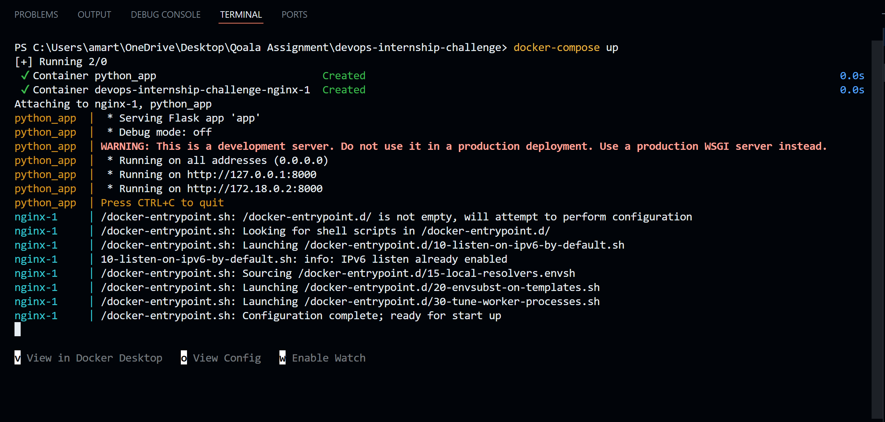

# DevOps Assignment Report

## Assignment Overview

This report documents the process of debugging and deploying a Dockerized application consisting of a Python Flask application and an Nginx server. The application was built and run using Docker and Docker Compose, with various intentional errors identified and resolved during the assignment.

## Result




## Cloud Deployment

[View through this endpoint](ec2-54-196-134-19.compute-1.amazonaws.com/) (http request supported)

## Project Structure

The project contains the following files and directories:

- `docker-compose.yml` - Configuration file for Docker Compose.
- `Dockerfile` (Python) - Defines the Python application container.
- `Dockerfile` (Nginx) - Defines the Nginx server container.
- `nginx.conf` - Configuration file for Nginx.
- `app.py` - The main Python application file.

## Tasks Completed

1. **Initial Setup**

   - Cloned the GitHub repository containing the application code and Docker configurations.
   - Built Docker images for both the Python and Nginx services.

2. **Building Docker Images**

   - Corrected the Dockerfile for the Python application.
   - Corrected the Dockerfile for the Nginx server.
   - Built Docker images using the following commands:

     ```bash
     docker build -t local-python-app ./Python
     docker build -t local-nginx ./nginx
     ```

     

3. **Running the Docker Compose File**

   - Launched all services using Docker Compose:

     ```bash
     docker-compose up
     ```

     

4. **Debugging and Testing**
   - Checked logs and identified several errors, which were resolved as detailed below.

## Errors Encountered and Resolutions

### Nginx Dockerfile Changes (nginx/Dockerfile)

- **Base Image**: Changed from `FROM nginx:latests` to `FROM nginx:latest`.
- **Configuration File**: Corrected the COPY command from `COPY nginix.conf /etc/nginx/nginx.conf` to `COPY nginx.conf /etc/nginx/nginx.conf`.
- **Port Exposure**: Fixed port definition from `EXPOSE "eighty"` to `EXPOSE 80`.
- **Run Command**: Updated the command from `CMD ["nginx", "-g", "daemon of;"]` to `CMD ["nginx", "-g", "daemon off;"]`.

### Nginx Configuration File Changes (nginx/nginx.conf)

- **Worker Processes**: Fixed Typo from `worker_process` to `worker_processes`.
- **Worker Connections**: Fixed Typo from `worker_connection` to `worker_connections`.
- **MIME Types Include**: Fixed Typo from `include /etc/nginx/mime.typess` to `include /etc/nginx/mime.types`.
- **Default Type**: Fixed Typo from `default_typ` to `default_type`.

### Python Dockerfile Changes (python/Dockerfile)

- **Working Directory**: Changed `WORKDIR /appp` to `WORKDIR /app`.
- **File Copy**: Changed `COPY appy.py /app` to `COPY app.py /app`.
- **Package Installation**: Changed the package name from `netiface` to `netifaces`.
- **Port Exposed**: Changed `EXPOSE "eight thousand"` to `EXPOSE 8000`.
- **Run Command**: Corrected `CMD ["pythn", "app.py"]` to `CMD ["python", "app.py"]`.

### Docker Compose File Changes (docker-compose.yaml)

- **Removed Version**: Removed the version declaration, as it is automatically handled by Docker.
- **Nginx Service**: Corrected port mapping from `"eighty:80"` to `"80:80"`.
- **Volumes**: Ensured the correct path for the Nginx configuration file and HTML directory.
- **Dependencies**: Added `depends_on` to indicate that `python-app` should start before `nginx`.
- **Exposed Ports**: Corrected the exposed port for the Python application from `"eight thousand"` to `8000`.

## Errors Encountered and Resolved

1. **Docker Image Not Found**: Errors related to pulling images that did not exist were fixed by verifying and correcting image names in the Dockerfiles.
2. **YAML Validation Errors**: Addressed configuration errors in the Docker Compose file, such as removing unsupported options.
3. **Service Startup Failures**: Fixed dependencies to ensure the Nginx service could start correctly after the Python application was running.

## Conclusion

Through this assignment, I successfully debugged and deployed a Dockerized application with two interconnected services (Python Flask and Nginx). All intentional errors were identified and resolved, resulting in a functional application running smoothly within Docker containers.
